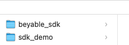

# Application démo Android pour le SDK mobile

## Implémentation
Le SDK peut etre importer avec le code source ou le package .aar
### Avec le code source
Pour l'importation du code source (plus facile pour la dev) il faut avoir le git du SDK cloner 
dans un dossier au coté de ce projet, importer le module pour implementer la librarie dans le projet.

#### Sur le `settings.gradle` du projet
```
include ':sdk'
project(':sdk').projectDir=new File('../beyable_sdk/sdk')
```
#### Sur le `build.gradle` du module de l'application
```
    implementation project(":sdk")
```
#### Disponibilités des plugins
Comme l'import est fait avec le module :sdk, il faut préciser les plugins gradle nécessaire au
`build.gradle` du projet. Pour ça, il faut rajouter ces lignes suivantes au `build.gradle` du projet:

```
id 'com.android.library' version '8.2.2' apply false
id 'org.jetbrains.kotlin.android' version '1.9.20' apply false
```
### Avec le package .aar
Pour l'import avec le package compilé, il faut copier le package .aar dans un dossier du projet 
(ici, on utilise le dossier `libs` du module de l'application).

Après, il suffit de le reférencer dans le `build.gradle` du module de l'application
```
implementation files('libs/beyable-sdk-release.aar')
```